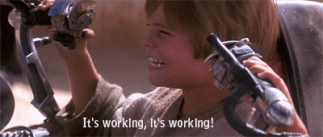

# Podracing Simulator

A real-time multiplayer podracing simulation where each player pilots their own pod on a shared 
track. 

Players send throttle and steering updates to the server via WebSockets and the server 
broadcasts updated positions, collisions, and race events back to all clients.

## Tech Stack

Frontend: [React](https://react.dev/) + [Typescript](https://www.typescriptlang.org/) with 
[Tailwindcss](https://tailwindcss.com/) and [Shadcn/ui](https://ui.shadcn.com/)

Backend: [Spring Boot](https://docs.spring.io/spring-boot/index.html)

Persistence: [Redis](https://redis.io/docs/latest/) for real-time race data, [PostgreSQL](https://a.postgresql.org/docs/current/) for persistent results/history.